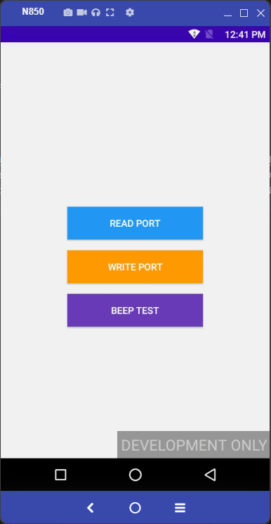

# Demo Comunicación Serial usando NSDK.

App demo para establecer comunicación serial con PINPAD P180.

## Funciones de NSDK utilizadas.
Se utiliza la interfaz **ExternalCommunicator** de NSDK que permite hacer uso de los métodos siguientes:
- **receive(int timeout)**: Para recibir información por puerto serial.
- **send(byte[] data, int timeout)**: Permite enviar datos por puerto serial.

## Flujo que hay que seguir.
1. Primero se inicializa el SDK mediante **NSDKModuleManagerImpl.getInstance().init(this)**. Se puede comprobar que se haga bien este paso llamando a beeper-
2. Se configura y abre el comunicador externo (en este caso USB) con **ExtNSDKModuleManagerImpl.getInstance().getNSDKCommunicator(...).open(timeout)**, asignándole un **CommunicatorListener** para manejar eventos de conexión.
3. Se pueden enviar datos con **communicator.send(byte[], timeout)** y recibirlos con **communicator.receive(timeout)**, manejando excepciones **NSDKException** en ambos casos.

